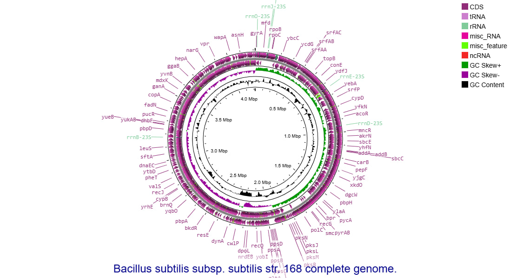
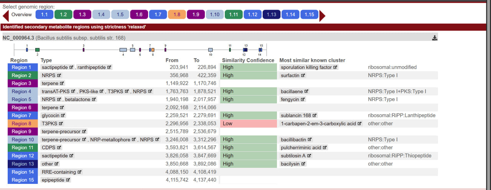
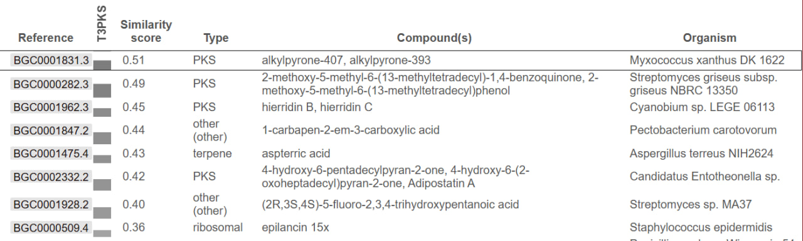
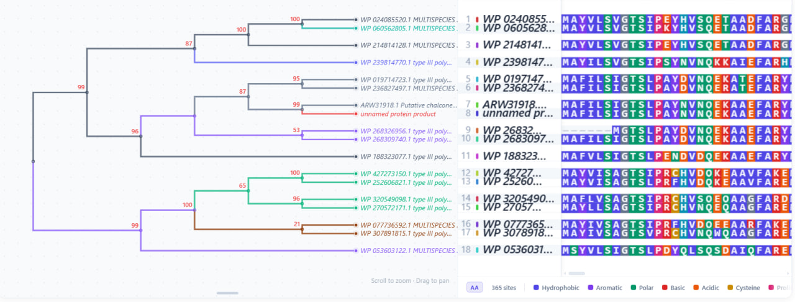

# antiSMASH-TypeIII-PKS-Analysis

# Genome Mining of a Type III Polyketide Synthase Biosynthetic Gene Cluster in *Bacillus subtilis*

## Overview

This project investigates a Type III Polyketide Synthase (T3PKS) biosynthetic gene cluster in *Bacillus subtilis* using comparative bioinformatics tools.

## Workflow

- Proksee
- antiSMASH
- MIBiG
- BLASTP
- MAFFT
- Phylogeny.fr

## Results

- Identified 15 biosynthetic gene clusters.
- Region 8 was selected for detailed analysis.
- The predicted protein showed:
  - 94% identity
  - 100% query coverage
  - E-value = 0.0

# Figures

## 1. Genome Map

---

## 2. antiSMASH Analysis

---

## 3. MIBiG Comparison

---

## 4. Phylogenetic Tree

---

## Project Report

The complete project report is available in:

antiSMASH project.pdf

## Tools Used

- Proksee
- antiSMASH
- MIBiG
- BLASTP
- MAFFT
- Phylogeny.fr
